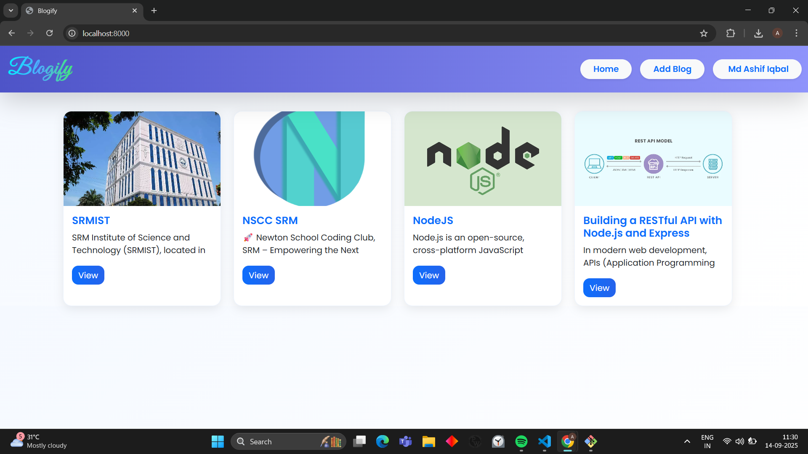
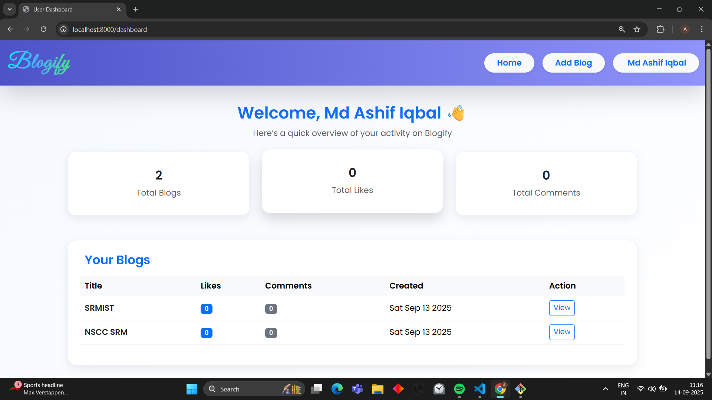
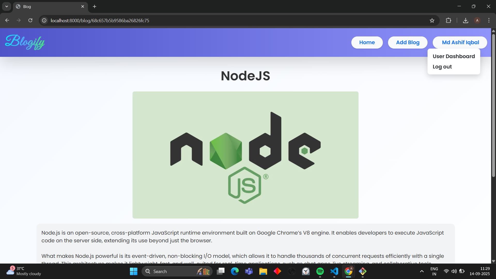
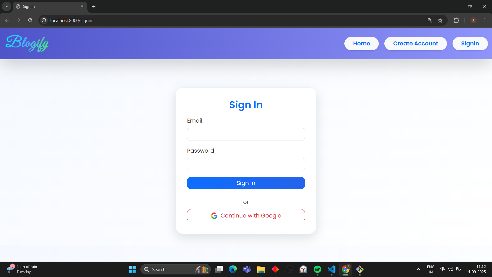
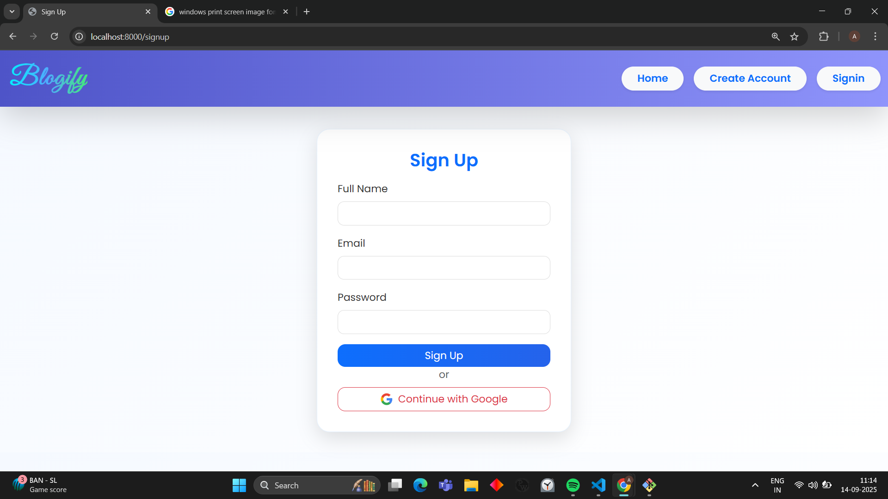

# 📖 Blogify

Developed for **Alexa Developers SRM Recruitment** to showcase **full-stack development skills**.


A full-stack **blog application** built with **Node.js, Express, MongoDB Atlas, and EJS**.

👉 Live Demo: [Blogify on Render](https://blogify-7epz.onrender.com/)

---

## ✨ Features

- User authentication with **Google OAuth 2.0** manually + **JWT (JSON Web Tokens)**.
- Logged-in users can **create, read, update, and delete (CRUD) posts**.
- Users can **like** and **comment** on posts.
- Image uploads handled with **Multer** and stored in **Cloudinary**.
- **Server-side rendering** with the EJS view engine.
- **Clean MVC architecture** with modular and well-documented code.
- Database hosted on **MongoDB Atlas**.
- Frontend built with **HTML, CSS, and JavaScript** (rendered through EJS templates).

---

## 🛠️ Tech Stack

- **Backend:** Node.js, Express.js
- **Frontend:** HTML, CSS, JavaScript (via EJS templates)
- **Database:** MongoDB Atlas (Mongoose ODM)
- **Authentication:** Google OAuth 2.0
- **Image Storage:** Cloudinary
- **Deployment:** Render (Free Tier)

---

## 📂 Project Structure

The project follows a **clean MVC architecture**:
blog-application/
├── models/ # Mongoose schemas
├── routes/ # Express routes
├── views/ # EJS templates (HTML, CSS, JS)
├── public/ # Static assets (CSS, JS, images)
├── screenshots/ # Screenshots for preview
├── app.js # Main server file
└── package.json # Project dependencies and scripts

## 🗄️ Database Schema

### User Model

```js

   {

    fullName: {
      type: String,
      required: true,
    },
    email: {
      type: String,
      required: true,
      unique: true,
    },
    salt: {
      type: String,
    },
    password: {
      type: String,
      required: true,
    },
    profileImageUrl: {
      type: String,
      default: "/images/default.png",
    },
    role: {
      type: String,
      enum: ["USER", "ADMIN"],
      default: "USER",
    }
   }
Blog Model

js
{
    title: {
      type: String,
      required: true,
    },
    body: {
      type: String,
      required: true,
    },
    coverImageUrl: {
      type: String,
      required: false,
    },
    createdBy: {
      type: Schema.Types.ObjectId,
      ref: "users",
    },
    likes: [
      {
        type: Schema.Types.ObjectId,
        ref: "users",
      },
    ],
  }
Comment Model
js
{
    content: {
      type: String,
      required: true,
    },
    blogId: {
      type: Schema.Types.ObjectId,
      ref: "blogs",
    },
    createdBy: {
      type: Schema.Types.ObjectId,
      ref: "users",
    },
  }


🚀 Getting Started
1. Clone the repo
git clone https://github.com/ashif-iqbal/blog-application.git
cd blog-application

2. Install dependencies
npm install

3. Configure Environment Variables

Create a .env file in the root with:

PORT=8000
MONGO_URI=your-mongodb-atlas-uri
CLOUDINARY_CLOUD_NAME=your-cloudinary-name
CLOUDINARY_API_KEY=your-cloudinary-api-key
CLOUDINARY_API_SECRET=your-cloudinary-secret
GOOGLE_CLIENT_ID=your-google-client-id
GOOGLE_CLIENT_SECRET=your-google-client-secret
GOOGLE_CALLBACK_URL=https://your-deployment-url/auth/google/callback


4. Run locally
npm start


Visit: http://localhost:8000
```

☁️ Deployment (on Render)

1. Push your project to GitHub.

2. Go to Render
   , create a new Web Service.

3. Connect your repo.

4. Set the Build Command:

npm install

5. Set the Start Command:

npm start

6. Add environment variables in the Render Dashboard (same as .env).

7. Deploy 🎉

Live Demo: https://blogify-7epz.onrender.com/

🤝 Contributing

Contributions, issues, and feature requests are welcome!

1. Fork the project.

2. Create your feature branch:

git checkout -b feature/YourFeature

3. Commit your changes:

git commit -m "Add some feature"

4. Push to the branch:

git push origin feature/YourFeature

5. Open a Pull Request.

📸 Preview

Here are some screenshots of Blogify in action:






🏆 About This Project

1. Built from scratch with no boilerplates.

2. Frontend is plain HTML, CSS, JS (rendered via EJS).

3. The codebase is clean, modular, and beginner-friendly.

4. Developed for Alexa Developers SRM Recruitment to showcase full-stack development skills.
